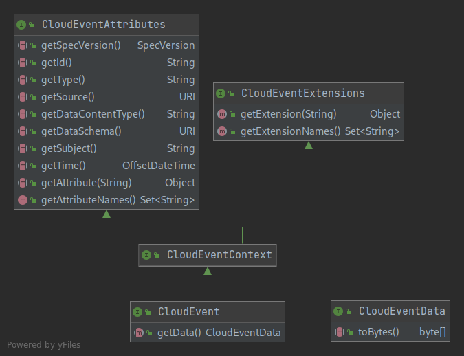
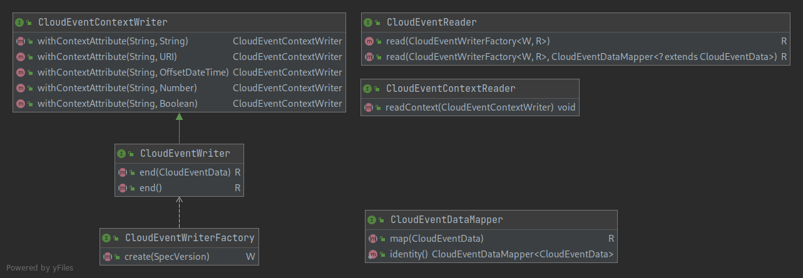

# CloudEvents API

[](http://www.javadoc.io/doc/io.cloudevents/cloudevents-api)

This module contains the interfaces to represent `CloudEvent` in memory and to
read and write an object using as CloudEvent.

For Maven based projects, use the following dependency:

```xml

<dependency>
    <groupId>io.cloudevents</groupId>
    <artifactId>cloudevents-api</artifactId>
    <version>2.4.2</version>
</dependency>
```

## `CloudEvent` hierarchy

`CloudEvent` is the main interface representing a read-only CloudEvent in-memory
representation. A `CloudEvent` is composed by its context attributes, including
the predefined attributes and the extensions, and the data.



`CloudEventData` is an abstraction to allow carrying any kind of data payload
inside a `CloudEvent`, while enforcing the ability of convert such data to
`[]byte`, ultimately used to send `CloudEvent` on the wire.

## Reader and Writer

The package `io.cloudevents.rw` contains the interfaces to read and write
objects as CloudEvents.



In other words, you can use these interfaces to perform an unstructured
read/write of an entity as CloudEvent. For example, an HTTP server request in
binary mode containing a valid CloudEvent can be translated to a
`CloudEventReader`. Similarly, an HTTP server response can be written as a
CloudEvent, hence an eventual response builder could implement
`CloudEventWriter`.

`CloudEventReader` and `CloudEventWriter` implementations doesn't have any
particular knowledge about specification version, difference between attributes
and extensions, and so on. Their only concern is how to read and write context
attributes and data back and forth to the "CloudEvents type system", as defined
in the package `io.cloudevents`.

A 3rd party implementer can implement these interfaces directly in its
`CloudEvent` in order to customize/implement efficiently the
marshalling/unmarshalling process. These interfaces are optional and, if your
`CloudEvent` doesn't implement it, a default implementation is provided by the
core module.

## Other interfaces

- `CloudEventExtension` represents a _materialized_ in-memory representation of a CloudEvent extension
- `SpecVersion` is an enum of CloudEvents' specification versions supported by this SDK version.
